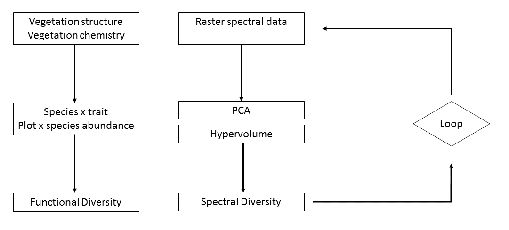
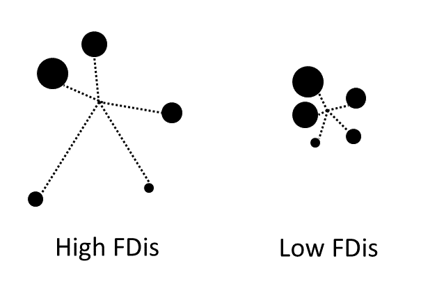
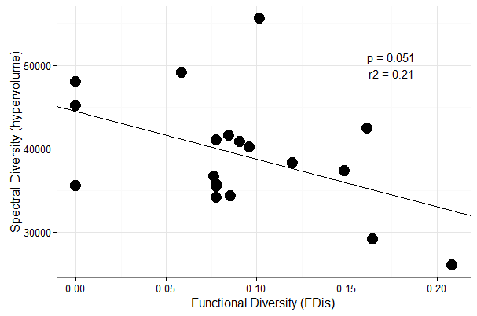

# Analysis of canopy nitrogen and functional diversity using hyperspectral imagery and LiDAR


```{r intro-section}


```

# Estimating canopy N foliar mass through a combintation of remote sensing, NEON in situ data, modelling, and training data.


# Extract and process plot-level remote sensing data


# Calculating functional and spectral diversity


## finding best h5 file

get overlap of two extents
```{r get-overlap, eval=FALSE}
overlap <- intersect(temp_ext, h5Extent)

```

check if overlap is the same as temp

```{r check-if-overlap, eval=FALSE}
if (temp_ext == overlap) {
  recordRaster[i] <- afile
  i <- i+1
} 
```

return remaining file
```{r return, eval=FALSE}
# only one file left
if (length(recordRaster) == 1) {
  returnFile <- recordRaster
  break
}

```

## Calculate Functional Dispersion (FDis):



```{r calc-FD, eval = FALSE }

FDresults=dbFD(traits,
               abundances,
               corr="lingoes",
               m=3)

```

## PCA on raster stack for each plot

```{r pca-raster, eval = FALSE }

a=rasterPCA(stack, 
            nComp = 3, 
            maskCheck=FALSE, 
            norm = TRUE, 
            spca = TRUE)

```

## Calculate hypervolume
 
 
```{r calc-hypervol, eval = FALSE }

hypervol = hypervolume(vals,
                       bandwidth=estimate_bandwidth(vals,
                                                    method="silverman"))
```

## Correlate Functional Diversity and Spectral Diversity


